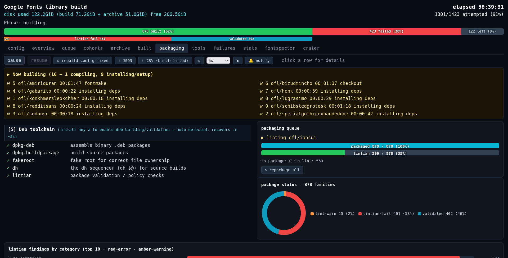
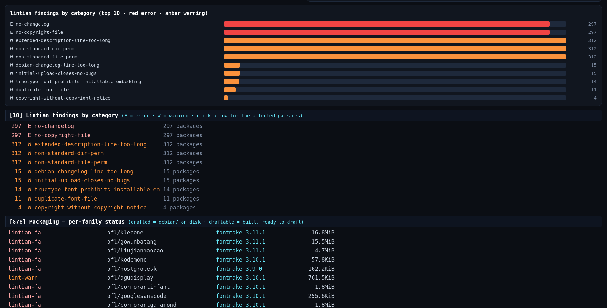

# gflib-build

**Build the entire Google Fonts library from source, on your own machine — Rust-first, with a live dashboard.**

> ⚠️ **Experimental — a very early prototype.** This is research tooling under active
> development. Flags, the on-disk schema, and behavior can change without notice, and many
> features are incomplete or rough. It is not production-ready. See [Caveats & pitfalls](#caveats--pitfalls).

`gflib-build` clones every buildable family in the [Google Fonts](https://github.com/google/fonts)
library, compiles each one from its pristine upstream source, and records **exactly which compiler
and version built — or failed to build — every family**. It prefers [`fontc`](https://github.com/googlefonts/fontc)
(the Rust font compiler) and falls back to `fontmake` (Python), so the per-family record doubles as a
**measurement of how much of the library already builds with the Rust toolchain**.

The whole run is driven from a **live dashboard** — a terminal UI or a browser — that you can detach
from and reattach to while builds keep running in the background.





*The browser dashboard (`--ui web`), shown here on the optional `.deb`-packaging view. The same live
state renders identically in the terminal UI (`--ui curses`).*

## Why

The north star is a **fully reproducible build of the whole Google Fonts library on the latest
`fontc`, with zero Python in the pipeline.** We're not there yet — so the tool deliberately uses
whatever compiler works *today* while recording the compiler and exact version for every family, and
tracks progress along a milestone ladder:

| | Milestone |
|---|---|
| **M0** | Measurement foundation — record compiler + exact version for every build attempt |
| **M1** | Full buildability — 100% of buildable families produce the expected fonts (any backend) |
| **M2** | fontc-gap map — every buildable family attempted with `fontc`, the result recorded |
| **M3** | fontc equivalence — `fontc` output equivalent to `fontmake`/shipped, at scale |
| **M4** | fontc majority — families that build correctly with `fontc` alone (no fontmake fallback) |
| **M5** | Python-free pipeline — Rust-native `gftools-builder3`, no Python pre-build or deps |
| **M6** | latest-fontc currency — the M4/M5 set re-validated on the newest `fontc` |
| **M7** | 100% Rust — the whole library: latest `fontc`, equivalent output, zero Python |

See [`docs/migration-milestones.md`](docs/migration-milestones.md) for the full framing.

## Features

- **Live dashboard, two frontends** — a navigable terminal UI (`--ui curses`) and a browser
  dashboard (`--ui web`), both rendered from the same live snapshot.
- **Detach & resume** — builds run in a background daemon; quit the dashboard and the build keeps
  going; re-run to reattach. State is resumable across restarts.
- **Rust-first, graceful fallback** — every family is attempted with the Rust-native
  [`gftools-builder3`](https://github.com/simoncozens/gftools-builder3) first (zero Python in the
  loop), then `gftools-builder` + `fontc`, then `fontmake` — recording which orchestrator and
  compiler built each family (the migration metric).
- **Zero-setup toolchain** — pinned `fontc` and `gftools-builder3` releases are auto-installed
  (one-time `cargo install` into `<data-dir>/tools/`) when not found; no flags, no manual setup.
- **Dependency cohorts** — families that share an identical pinned dependency set share one virtual
  environment, instead of one venv per family or one giant venv.
- **Multi-Python ladder** — `--pythons` falls back to an older interpreter (keeping the exact pins)
  before relaxing anything, to satisfy era-specific wheels.
- **Archive-safe** — sources are read **read-only** (`git archive` from bare mirrors); upstream
  repos are never modified and never deleted; every byte of output lands in a separate build dir.
- **Provenance (M0)** — records the compiler and exact version for every family, success or failure.
- **Parallel & streaming** — a worker pool builds while the archive mirrors and cohorts are scanned,
  with no barriers between phases.
- **Optional extras** — `fontc_crater` comparison, `fontspector` QA, and `.deb` packaging of built
  families (all works-in-progress).

## Install

Building the tool needs only a **Rust toolchain** ([rustup](https://rustup.rs)). The dependency
footprint is intentionally tiny (`serde`, `serde_json`, `crossterm`).

```sh
git clone <this-repo> gflib-build
cd gflib-build/rust
cargo build --release            # binary at target/release/gflib-build
```

Optionally put a launcher on your `PATH`:

```sh
./install-cli.sh                 # installs ~/.local/bin/gflib-build
```

To actually **build fonts** you also need, at runtime:

- `git` and `python3` on your `PATH` (the tool creates cohort virtualenvs and installs pinned
  build deps into them automatically);
- a **worklist source** — either a [`google/fonts`](https://github.com/google/fonts) clone
  (`--source metadata`, the default) or a *repo archive* of bare mirrors (`--source archive`).

The Rust toolchain (`fontc` and `gftools-builder3`) needs **no setup**: pinned releases are
auto-installed on first run (a one-time `cargo install` into `<data-dir>/tools/`, visible as
pipeline tasks). `--fontc-bin`/`--builder3-bin` override with your own binaries;
`--no-toolchain-provision` disables the auto-install.

## Quick start

```sh
# 1. See what would be built (read-only), from a google/fonts clone:
gflib-build --list --google-fonts /path/to/google/fonts

# 2. Build a small evenly-spaced sample with the live terminal dashboard. It opens on an
#    interactive Configuration tab — set things up, then ▶ Start (pass --setup to force it).
gflib-build --google-fonts /path/to/google/fonts --percent 2

# 3. Same, but watch it in your browser:
gflib-build --google-fonts /path/to/google/fonts --percent 2 --ui web   # http://localhost:8765

# 4. Kick the tires with no real builds — replay a recorded session live:
gflib-build --demo --ui web
```

Useful flags: `--only ofl/abel,ofl/roboto` (explicit subset), `--backend fontc|fontmake|both`,
`--jobs N`, `--attach` (monitor a running build), `--stop` (cancel it), `--reset --yes` (wipe the
build dir — the archive is never touched). Run `gflib-build --help` for the full surface.

## How it works

A background **daemon** owns the build directory and writes an atomic `status.json` snapshot ~once a
second; every UI is a thin **monitor** that reads it and sends live commands back through
`control.json` — so the terminal UI, the web UI, and external tools all observe the same state, and
only one daemon owns a build dir at a time.

For each family the pipeline: resolves the upstream repo + pinned commit, streams the **pristine tree
at that commit** out of a bare mirror, pre-cleans any committed build outputs, resolves the build
config, builds it in the right cohort venv (fontc → fontmake fallback), then collects the fonts +
full log into the build dir and records provenance.

The internals are documented in [`docs/ARCHITECTURE.md`](docs/ARCHITECTURE.md); adding a
frontend or backend is covered in [`docs/EXTENDING.md`](docs/EXTENDING.md).

## Repository layout

```
rust/                 the tool (Rust) — see rust/README.md to build & hack on it
  src/                ~12.5k LOC across ~19 modules (build engine, TUI, web, daemon, venvs, …)
docs/                 architecture, extending, milestones, specifications, design reports (+ PDFs)
build_rules.json      per-family pre-compile steps (see the caveat below)
requirements-build.txt the pinned base GF build toolchain installed into the base cohort venv
gflib-data/           local data + build output (git-ignored; created on first run)
```

## Caveats & pitfalls

- **It's an early prototype.** Expect rough edges, breaking changes, and half-finished features.
  Treat outputs as provisional and verify anything important.
- **Real builds are heavy.** A full library run is **tens of GB** of clones, virtualenvs, and font
  output plus many CPU-hours. Always start small — `--percent 2` or `--only <family>` — and only
  scale up once it's behaving.
- **You must supply a worklist source.** Either a `google/fonts` clone (several GB) or a repo
  archive of bare mirrors (tens of GB if you mirror everything). The tool can populate a missing
  archive, but it won't conjure sources from nothing.
- **One daemon per build dir.** Re-running while a daemon already owns the build dir attaches a
  monitor instead of starting a new build; `--stop` first if you really want to restart. A daemon
  that was killed uncleanly can leave a stale lock.
- **"Rust-first" is per-family, not absolute.** A family is Python-free only when the
  `gftools-builder3` attempt succeeds; families it can't build yet fall back to the Python
  `gftools.builder` (with `fontc`, then `fontmake`). The stats tab's `builder3(M5)` count is the
  honest measure — a full Python-free build is a milestone (M5/M7), **not** the current reality.
- **First-run toolchain provisioning takes minutes.** Installing the pinned `gftools-builder3`
  compiles a ~700-crate dependency tree (and `fontc` similarly) — a one-time cost, shown live as
  pipeline tasks; later runs reuse the cached installs under `<data-dir>/tools/`.
- **Output is not guaranteed identical to shipped fonts.** The tool *measures* and records what
  built each family; byte-for-byte equivalence to the shipped/fontmake binaries is a goal (M3),
  not a promise.
- **`build_rules.json` can change shipped output.** Some per-family pre-compile rules edit the
  upstream source to make it build, and a number of those edits are **under active review** — see
  [`docs/build-rules-review.pdf`](docs/build-rules-review.pdf). Don't assume a rule is a correct fix.
- **Dependency self-healing relaxes pins.** When a pinned build dependency has no installable wheel,
  the tool drops just that pin and lets pip resolve a compatible version (surfaced in the config
  tab). Reproducibility holds for everything that resolves, but a relaxed pin is a deviation.
- **The optional extras are WIP.** `.deb` packaging, `fontspector` QA, and the `fontc_crater`
  comparison are incomplete and may produce incomplete or imperfect results.
- **Linux/macOS only.** No Windows support. `git` and `python3` must be on `PATH` for real builds.

## Documentation

- [`docs/ARCHITECTURE.md`](docs/ARCHITECTURE.md) — how the pipeline, daemon, and schemas work
- [`docs/EXTENDING.md`](docs/EXTENDING.md) — add a new frontend or build backend
- [`docs/migration-milestones.md`](docs/migration-milestones.md) — the M0–M7 north-star ladder
- [`docs/SPECIFICATIONS.md`](docs/SPECIFICATIONS.md) — the original verbatim requirements
- [`rust/README.md`](rust/README.md) — build, test, and module map for contributors
- [`docs/`](docs/) — design reports (build-fix provenance, dependency cohorts, `.deb` packaging,
  the build-rules review) as Markdown + PDF

## Contributing

Contributions are welcome — see [`CONTRIBUTING.md`](CONTRIBUTING.md) for how to build, run the
tests, and find your way around the code.

## License

[Apache License 2.0](LICENSE).

---

*This tool and its documentation were assisted by an AI agent (Claude Opus 4.8) under the guidance of
[@felipesanches](https://github.com/felipesanches).*
